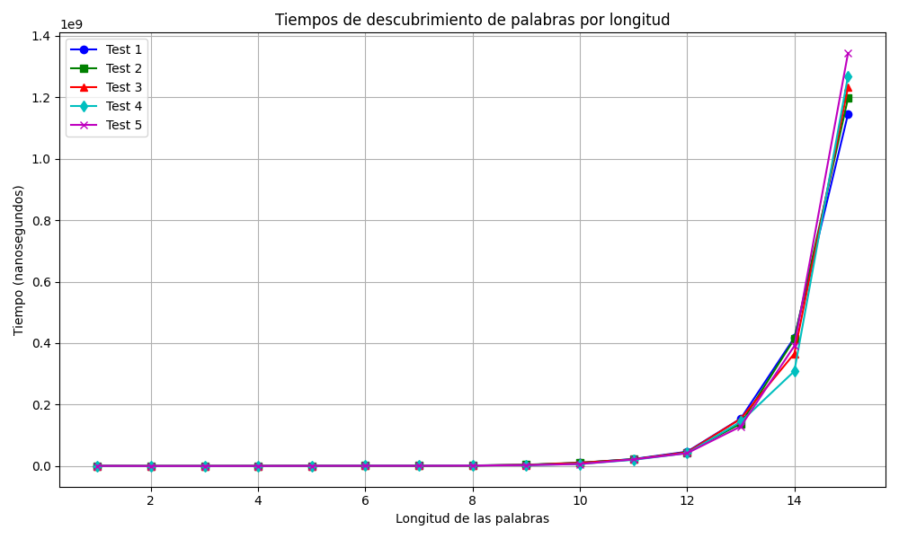

# Trabajo Práctico Obligatorio de Programación III: Backtracking
## Grupo

- Massi, Franco Baltasar
- Antoniow, Manuel 

Buenos Aires, 21 de Junio de 2024.

## Generador de Palabras con Backtracking

Este repositorio contiene un algoritmo en Java para generar todas las posibles combinaciones de palabras dentro de un rango específico de longitud, utilizando conjuntos predefinidos de letras. El proyecto emplea la técnica de backtracking para explorar sistemáticamente configuraciones válidas de palabras.

## Introducción
El lenguaje humano ha evolucionado a lo largo de milenios, conformando un extenso alfabeto de letras que se combinan para formar palabras de variadas longitudes. Estas palabras, a su vez, constituyen el tejido del universo lingüístico en el que nos comunicamos y expresamos ideas. En este contexto, surge la necesidad de desarrollar algoritmos capaces de explorar y generar todas las combinaciones
posibles de palabras dentro de un rango específico de longitud, utilizando conjuntos predeterminados de letras. 
El objetivo de este trabajo es diseñar un algoritmo basado en la técnica de Backtracking para encontrar todas las palabras posibles que se puedan formar con letras provenientes de N conjuntos, respetando un rango de longitud de X a Y letras. Este enfoque permite generar palabras de manera sistemática y eficiente,
respetando las restricciones impuestas por los conjuntos de letras y los límites de longitud. Primero, desarrollaremos nuestra estrategia para abordar el problema, considerando las particularidades y desafíos que presenta. A continuación, presentaremos el pseudocódigo que formaliza la solución propuesta, seguido de un
análisis detallado de la complejidad teórica del algoritmo. Por último, implementaremos el algoritmo en Java y realizaremos pruebas empíricas para verificar si la complejidad temporal observada coincide con la teórica.

## Descripción del Problema
Diseñar un algoritmo utilizando la técnica Backtracking para encontrar todas las palabras posibles de X a Y letras, donde X e Y son los límites del rango de la longitud de las palabras a encontrar.

Entrada:
- Dos números enteros X e Y, que representan el rango de longitud de las palabras a generar y N conjuntos de letras, donde cada conjunto representa las posibles letras en una posición específica de la palabra.

Salida:
- Todas las palabras posibles que se pueden formar utilizando las letras de los conjuntos dados y que tengan una longitud en el rango de X a Y (X ≤ longitud de la palabra ≤ Y).

## Técnica de Backtracking
Backtracking es una técnica algorítmica para resolver problemas recursivamente construyendo una solución de pieza en pieza y removiendo soluciones que fallan en cumplir los criterios del problema en cualquier punto del tiempo. Es particularmente útil para problemas que requieren la generación de todas las configuraciones posibles de un conjunto dado, como el problema de generación de palabras en este caso.

## Estrategia de Resolución
El algoritmo utilizará la técnica de backtracking para generar todas las posibles combinaciones de letras que forman palabras dentro del rango de longitud especificado. La idea es construir las palabras de forma recursiva, agregando una letra a la vez y retrocediendo cuando se alcanza una longitud.

## Funcionamiento del Algoritmo

El algoritmo `generarPalabras` se implementa utilizando la técnica de backtracking, lo que permite construir palabras paso a paso y podar ramas que exceden la longitud máxima deseada. A continuación se describe el flujo y las características clave del algoritmo:

### Inicialización y Configuración

El proceso comienza con la función `descubrirPalabrasDeLaHumanidad`, la cual establece los parámetros iniciales para la generación de palabras, incluyendo los conjuntos de letras y los rangos de longitud.

### Generación de Palabras

Para cada longitud de palabra en el rango especificado (desde `rangoDesde` hasta `rangoHasta`), se invoca la función `generarPalabras`. Esta función construye todas las combinaciones posibles de palabras utilizando los conjuntos de letras proporcionados.

### Backtracking

- **Construcción de Palabras:** Comienza con una palabra vacía y agrega letras recursivamente. Cuando se alcanza la longitud objetivo de la palabra, se agrega al conjunto de resultados.
  
- **Poda:** Detiene la exploración de ramas cuando se alcanza la longitud máxima deseada para optimizar el proceso de generación.

- **Recursividad:** Explora todas las combinaciones posibles de letras para cada posición de la palabra, manteniendo el orden de los conjuntos de letras.

### Resultados

Al finalizar todas las iteraciones y llamadas recursivas, la lista `resultado` contiene todas las palabras generadas dentro del rango especificado.

Este enfoque asegura la exhaustividad en la generación de palabras dentro de los límites establecidos por los parámetros `X` (rango mínimo) y `Y` (rango máximo), utilizando eficientemente los conjuntos de letras proporcionados.

## Pseudocódigo

## Análisis de Complejidad Temporal Teórica y Práctica

El análisis de complejidad temporal del algoritmo se desglosa como sigue:

### Teórica
La función generarPalabras es recursiva y se llama L veces en el peor de los casos, siendo L la cantidad de letras que tiene el conjunto que estamos analizando. Por lo tanto, podemos estimar…
- A = L, ya que se llama L veces a la función, siendo L el número de letras que tiene la etapa que estamos analizando. Este número muy probablemente sea mayor a 1.
- B = 1, ya que en cada llamado recursivo se reduce en uno la entrada, siendo esta nuestros conjuntos de letras posibles.
- K = 0, ya que el peor de los costos externos a la función recursiva son constantes.

Como se trata de una resta, la complejidad temporal se define por:

Esta función cae en el caso A > 1. Por lo tanto, la complejidad temporal, en el peor de los casos es igual a…

donde \( L \) representa el número de letras en los conjuntos de letras analizados y n la cantidad de conjuntos de letras para formar palabras que se pasa por parametro

### Práctica

Durante la evaluación de la complejidad práctica del algoritmo `descubrirPalabrasDeLaHumanidad`, se observó un aumento significativo en el tiempo de ejecución a medida que se incrementaba la longitud máxima de las palabras generadas. Los resultados experimentales muestran una tendencia que sugiere un crecimiento exponencial en el tiempo de ejecución conforme aumenta la complejidad del problema.

Aunque la teoría predice un incremento que triplicaría el tiempo de ejecución en promedio con cada incremento de longitud, ya que las pruebas se realizaron con conjuntos de longitud L = 3, en la práctica se registró un aumento promedio del 128.21% respecto al intervalo anterior. Este fenómeno indica que si bien el algoritmo exhibe una complejidad exponencial, la implementación práctica muestra un aumento más moderado en el tiempo de ejecución.

Estos hallazgos son consistentes con la naturaleza del algoritmo de backtracking utilizado, el cual, si bien es eficaz para generar todas las combinaciones posibles de palabras, enfrenta desafíos en términos de rendimiento cuando se amplían los rangos de longitud de las palabras buscadas.

### Conclusiones
Basado en los resultados obtenidos del algoritmo `descubrirPalabrasDeLaHumanidad`, se puede concluir que el mismo es efectivo para generar una variedad significativa de palabras dentro de los parámetros establecidos. Además, el método utilizado para generar conjuntos aleatorios de letras, utilizando Random y una cadena que contiene todas las letras del alfabeto, ha mostrado ser efectivo para la creación sistemática de palabras dentro de rangos específicos de longitud y complejidad.

A partir de los resultados de la medición de la complejidad temporal práctica del algoritmo `descubrirPalabrasDeLaHumanidad`, se pueden hacer las siguientes observaciones:

- **INCREMENTO DEL TIEMPO DE EJECUCIÓN CON LA LONGITUD DE LAS PALABRAS:** Se observó que a medida que se incrementa la longitud de las palabras generadas, el tiempo de ejecución del algoritmo aumenta significativamente. Los gráficos del costo temporal en función de la cantidad máxima de letras muestran una tendencia que parece seguir una función exponencial. Sin embargo, aunque este incremento sugiere una tendencia exponencial, se esperaría que cada incremento triplicara el tiempo de ejecución en promedio (alrededor del 200%). Esto se debe a que el conjunto de entrada probado tenía una longitud igual a 3 para cada conjunto de letras. En la práctica, el incremento promedio registrado apenas supera la duplicación, siendo este del 128.21% respecto al intervalo anterior.

- **VARIABILIDAD EN LOS TIEMPOS DE EJECUCIÓN:** Aunque se realizaron cinco pruebas independientes para obtener resultados más precisos, se notó una variabilidad en los tiempos de ejecución para rangos de longitud similares. Esto puede atribuirse a factores como la gestión de memoria y la carga de procesamiento del sistema durante la ejecución de las pruebas.

- **LÍMITE SUPERIOR DEBIDO A LA MEMORIA:** Se determinó que la distancia entre el rango mínimo y máximo de letras no puede exceder 15 (al menos para una entrada cuyos conjuntos contengan tres letras) debido a las limitaciones de memoria para almacenar los resultados generados. Este límite establece una restricción práctica en la utilización del algoritmo para conjuntos de datos más grandes o más complejos.
